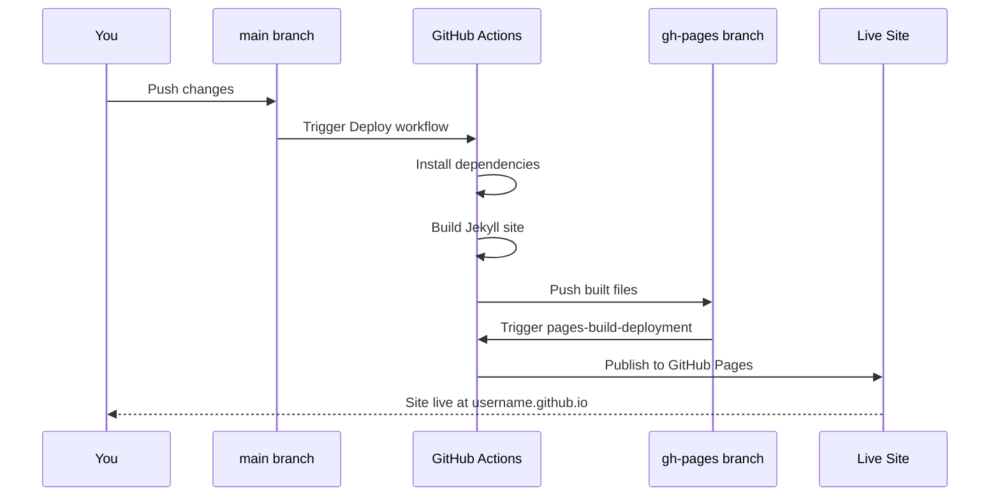
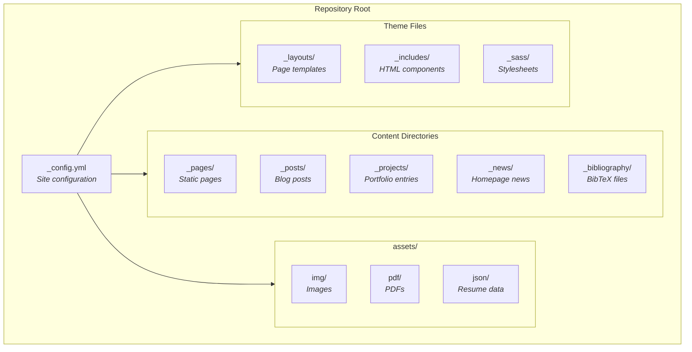

Last year, I decided to rebuild my personal website. After evaluating countless options—from full-blown frameworks like Next.js to simple HTML templates—I landed on something that struck the perfect balance between features and simplicity: the [al-folio](https://github.com/alshedivat/al-folio){:target="\_blank"} Jekyll theme. It's become one of the most popular academic portfolio themes on GitHub, with over 14,000 stars and a thriving community of developers, researchers, and academics using it worldwide.

In this guide, I'll walk you through setting up your own al-folio-powered website from scratch and deploying it to GitHub Pages—completely free. By the end, you'll have a professional portfolio site with blog functionality, project showcases, publication management, and automatic deployments every time you push a change.

## Why al-folio?

Before diving into the setup, it's worth understanding what makes al-folio compelling:

- **Zero hosting costs.** GitHub Pages provides free hosting for static sites, and al-folio is optimised to work seamlessly with it.
- **Academic-friendly features out of the box.** Publications from BibTeX, CV generation, project portfolios, and a clean blog—all ready to go.
- **Automatic deployments.** Push to your main branch, and GitHub Actions handles the rest. No manual build steps, no FTP uploads.
- **Active maintenance.** The theme receives regular updates, security patches, and new features from a dedicated maintainer team.
- **Performance.** The generated static site scores consistently high on Lighthouse performance audits.

The theme is built on Jekyll, a static site generator written in Ruby. Don't worry if you're not familiar with Ruby—you won't need to write any. Jekyll transforms your Markdown content and configuration files into a fast, static website.

## Prerequisites

You'll need a GitHub account. That's genuinely it for the basic setup. If you want to run the site locally for development (which I recommend), you'll also want Docker installed on your machine.

---

## Part 1: Creating Your Repository

The al-folio repository is set up as a GitHub template, which makes getting started straightforward.

### Step 1: Use the Template

Navigate to the [al-folio repository](https://github.com/alshedivat/al-folio){:target="\_blank"} and click the green **Use this template** button, then select **Create a new repository**.

Here's the critical part: **your repository name matters**. For a personal GitHub Pages site, your repository must be named exactly `<your-username>.github.io`. For example, if your GitHub username is `janedoe`, name the repository `janedoe.github.io`. This naming convention tells GitHub to serve this repository as your personal site at `https://janedoe.github.io`.

If you're creating a project site instead (hosted at `<username>.github.io/<project-name>`), you can name the repository whatever you like, but you'll need to configure the `baseurl` setting differently—I'll cover that later.

> **Screenshot opportunity:** Capture the GitHub "Use this template" button and the repository creation form showing the correct naming convention.
{: .block-tip }

### Step 2: Configure Repository Permissions

Before your site can deploy automatically, you need to grant GitHub Actions the appropriate permissions:

1. Go to your new repository's **Settings**
2. Navigate to **Actions** → **General** in the left sidebar
3. Scroll down to **Workflow permissions**
4. Select **Read and write permissions**
5. Click **Save**

This allows the deployment workflow to push the built site to the `gh-pages` branch.

> **Screenshot opportunity:** Capture the Settings → Actions → General page showing the Workflow permissions section with "Read and write permissions" selected.
{: .block-tip }

### Step 3: Update the Configuration

Open `_config.yml` in your repository. This file controls most of your site's behaviour and metadata. At minimum, you need to update two settings.

For a **personal site** at `your-username.github.io`:

```yaml
url: https://your-username.github.io
baseurl: # leave empty for personal sites
```

Don't delete the `baseurl` line—leave it as `baseurl:` with nothing after the colon.

For a **project site** at `your-username.github.io/project-name/`:

```yaml
url: https://your-username.github.io
baseurl: /project-name/
```

Commit this change to your main branch.

### Step 4: Wait for the Initial Deployment

After committing your `_config.yml` changes, head to the **Actions** tab in your repository. You should see a workflow called **Deploy site** running.

The deployment process follows this sequence:



The first run takes around 4 minutes. Once it completes successfully, you'll have a new `gh-pages` branch in your repository.

> **Screenshot opportunity:** Capture the Actions tab showing a successful "Deploy site" workflow run with the green checkmark.
{: .block-tip }

### Step 5: Configure GitHub Pages Source

Now you need to tell GitHub Pages where to find your built site:

1. Go to **Settings** → **Pages**
2. Under **Build and deployment**, ensure **Source** is set to **Deploy from a branch**
3. Set the branch to `gh-pages` (not `main`)
4. Leave the folder as `/ (root)`
5. Click **Save**

A second workflow called `pages-build-deployment` will now run. This typically takes under a minute. Once it completes, your site is live at `https://your-username.github.io`.

> **Screenshot opportunity:** Capture the Settings → Pages configuration showing gh-pages branch selected as the source.
{: .block-tip }

---

## Part 2: Understanding the Project Structure

Before customising your site, it helps to understand how al-folio organises its files:



The underscore prefix on folder names is a Jekyll convention—these directories are processed during the build but don't appear directly in your site's URL structure.

---

## Part 3: Personalising Your Site

### Essential Configuration

Open `_config.yml` and work through these key settings:

```yaml
# Personal info
first_name: Your
middle_name: Middle  # optional
last_name: Name
email: you@example.com
description: >
  A brief description of yourself and your site.
  This appears in search results and social shares.
keywords: jekyll, portfolio, academic  # for SEO

# Display settings
navbar_fixed: true
footer_fixed: true
```

The file is well-commented, so read through each section. Pay particular attention to:

- **Social integration**: Add your GitHub, LinkedIn, Twitter handles
- **Analytics**: Configure Google Analytics if you want visitor tracking
- **Blog settings**: Control pagination, related posts, and comments
- **Scholar settings**: Configure how publications are sorted and displayed

### Customising the About Page

Your homepage is defined in `_pages/about.md`. This uses a combination of Markdown for content and YAML front matter for metadata:

```markdown
---
layout: about
title: about
permalink: /
subtitle: Your tagline or affiliation

profile:
  align: right
  image: prof_pic.jpg  # place in assets/img/
  image_circular: false
  more_info: >
    <p>Your office address</p>
    <p>City, Country</p>

news: true  # show news items
selected_papers: true  # show selected publications
social: true  # show social links in footer
---

Write your bio here using standard Markdown.
```

Replace `prof_pic.jpg` with your own image in `assets/img/`.

### Creating Pages

To add a new page, create a Markdown file in `_pages/`. For example, to add a "Teaching" page:

```markdown
---
layout: page
permalink: /teaching/
title: teaching
description: Courses I teach and have taught.
nav: true
nav_order: 5
---

Your teaching content here...
```

The `nav: true` setting adds the page to your navigation bar, and `nav_order` controls its position.

### Writing Blog Posts

Blog posts live in `_posts/`. The filename must follow the pattern `YYYY-MM-DD-title.md`:

```markdown
---
layout: post
title: My First Post
date: 2024-12-14 10:00:00
description: A brief description for previews
tags: [python, machine-learning]
categories: [tutorials]
---

Your post content in Markdown...
```

al-folio supports rich blog features including syntax-highlighted code blocks, LaTeX mathematics via MathJax, Mermaid diagrams, image galleries with Bootstrap grid layouts, table of contents generation, and Distill-style layouts for technical posts.

### Adding Projects

Create project entries in `_projects/`:

```markdown
---
layout: page
title: Project Name
description: Brief project description
img: assets/img/project_thumbnail.jpg
importance: 1
category: work
---

Detailed project description...
```

Projects appear on a responsive grid at `/projects/`. The `importance` field controls sorting—lower numbers appear first.

### Managing Publications

al-folio uses BibTeX for publication management, which is particularly powerful if you're in academia. Edit `_bibliography/papers.bib`:

```bibtex
@article{smith2024example,
  title={An Example Paper Title},
  author={Smith, Jane and Doe, John},
  journal={Journal of Examples},
  year={2024},
  selected={true},
  pdf={example.pdf},
  abstract={Your paper abstract here...}
}
```

The `selected={true}` field marks papers to appear on your homepage. The `pdf` field links to files in `assets/pdf/`.

---

## Part 4: Local Development

While you can edit files directly on GitHub and wait for deployments, local development is faster for iterating on your site. You have two options:





Docker handles all the Ruby and Jekyll dependencies for you—no need to install anything else.

**1. Clone your repository:**

```bash
git clone git@github.com:your-username/your-username.github.io.git
cd your-username.github.io
```

**2. Pull and start the container:**

```bash
docker compose pull
docker compose up
```

The first run downloads a ~400MB Docker image. Once running, visit `http://localhost:8080` to see your site.

**3. Make changes and watch them reload:**

Changes to files are automatically detected and the site rebuilds in real-time. No need to restart.

**4. Stop the server:**

Press `Ctrl+C` or run in another terminal:

```bash
docker compose down
```





If you prefer not to use Docker, you can install Ruby and Bundler directly. This approach requires more setup but gives you direct control.

**1. Install prerequisites:**

- [Ruby](https://www.ruby-lang.org/en/downloads/){:target="\_blank"} (consider using [rbenv](https://github.com/rbenv/rbenv){:target="\_blank"} for version management)
- [Bundler](https://bundler.io/){:target="\_blank"} (`gem install bundler`)
- [Python](https://www.python.org/){:target="\_blank"} with pip (for Jupyter notebook support)

**2. Clone and install dependencies:**

```bash
git clone git@github.com:your-username/your-username.github.io.git
cd your-username.github.io
bundle install
pip install jupyter
```

**3. Serve the site:**

```bash
bundle exec jekyll serve
```

The site will be available at `http://localhost:4000`.

**4. Stop the server:**

Press `Ctrl+C` in the terminal.





---

## Part 5: Deployment and Custom Domains

### Automatic Deployments

Once your repository is configured, deployments are automatic. Every push to your main branch triggers the deploy workflow:


You can monitor progress in the **Actions** tab. Typical deployment time is 2-5 minutes.

### Setting Up a Custom Domain

To use your own domain instead of `username.github.io`:





Add DNS records with your domain registrar:

**For subdomain (www.yourdomain.com):**

```
CNAME  www  your-username.github.io
```

**For apex domain (yourdomain.com):**

```
A  @  185.199.108.153
A  @  185.199.109.153
A  @  185.199.110.153
A  @  185.199.111.153
```

See [GitHub's documentation](https://docs.github.com/en/pages/configuring-a-custom-domain-for-your-github-pages-site){:target="\_blank"} for full details.





Create a file named `CNAME` (no extension) in your repository root:

```
www.yourdomain.com
```

This file should contain only your domain name, nothing else.





In `_config.yml`, update the URL:

```yaml
url: https://www.yourdomain.com
baseurl: # leave empty
```





In your repository:

1. Go to **Settings** → **Pages**
2. Wait for DNS verification (may take a few minutes)
3. Check **Enforce HTTPS**

DNS propagation can take up to 24 hours, though it's often much faster.





---

## Part 6: Common Customisations

### Changing the Theme Colour

Edit `_sass/_themes.scss` and modify the `--global-theme-color` variable. The default is purple, but you can use any valid CSS colour value.

### Enabling Comments

al-folio supports Giscus for blog comments (powered by GitHub Discussions):

1. Set up Giscus at [giscus.app](https://giscus.app){:target="\_blank"}
2. Add the configuration to `_config.yml`:

```yaml
giscus:
  repo: your-username/your-username.github.io
  repo_id: # from giscus.app
  category: Announcements
  category_id: # from giscus.app
```

### CV Generation

You have two options for your CV page:





Use `assets/json/resume.json` following the [JSON Resume standard](https://jsonresume.org/){:target="\_blank"}:

```json
{
  "basics": {
    "name": "Your Name",
    "label": "Your Title",
    "email": "you@example.com",
    "summary": "A brief professional summary..."
  },
  "work": [...],
  "education": [...]
}
```





Use `_data/cv.yml` for a more readable format:

```yaml
- title: Education
  type: time_table
  contents:
    - title: PhD
      institution: University Name
      year: 2020
      description:
        - Description line 1
        - Description line 2
```

The theme falls back to YAML if no JSON file is found.





---

## Troubleshooting Common Issues

**Build fails immediately after setup**: Check that you've enabled read/write permissions for GitHub Actions under **Settings** → **Actions** → **General**.

**Site shows 404**: Ensure you've set the Pages source to the `gh-pages` branch, not `main`.

**Styles look broken**: Verify your `url` and `baseurl` settings in `_config.yml`. A trailing slash in `baseurl` where there shouldn't be one (or vice versa) is a common culprit.

**Changes not appearing**: GitHub Actions caches dependencies. Try re-running the failed workflow, or wait a few minutes for the cache to refresh.

**Local Docker build fails**: Ensure Docker has enough memory allocated (at least 4GB recommended). On macOS and Windows, check Docker Desktop settings.

---

## What's Next?

You now have a professional portfolio site that deploys automatically and costs nothing to host. From here, you might explore:

- **Adding analytics** with Google Analytics or privacy-focused alternatives like Plausible
- **Integrating Jupyter notebooks** into blog posts for interactive data science content
- **Customising layouts** by modifying files in `_layouts/` and `_includes/`
- **Keeping up to date** by periodically pulling changes from the upstream al-folio repository

The al-folio [FAQ](https://github.com/alshedivat/al-folio/blob/main/FAQ.md){:target="\_blank"} covers additional edge cases, and the [Discussions](https://github.com/alshedivat/al-folio/discussions){:target="\_blank"} tab is active with community support.

Building a personal site shouldn't be a weeks-long project. With al-folio, you can have something professional live within an hour, then iterate on it over time. The best portfolio site is the one that actually gets published—so commit that first change and get yours online.
